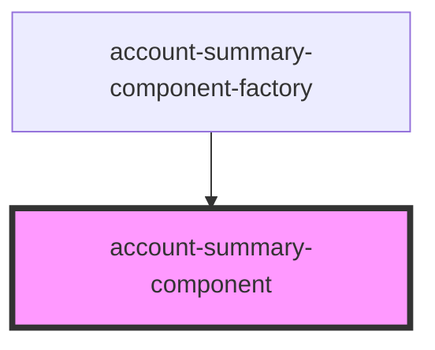

# account-summary-component

<!-- Auto Generated Below -->

## Properties

| Property            | Attribute | Description         | Type                | Default     |
| ------------------- | --------- | ------------------- | ------------------- | ----------- |
| `getAccountSummary` | --        | Get account summary | `GetAccountSummary` | `undefined` |

## Dependencies

### Used by

 - [account-summary-component-factory](../../../main/factories)

### Graph

----------------------------------------------

*Built with [StencilJS](https://stenciljs.com/)*
